# Attack-Simulation
This project utilizes Microsoft Defender’s Attack Simulation Training to enhance end-user security awareness. The simulation was designed to educate users about phishing risks and evaluate their readiness to identify and report phishing attempts.

## Process Overview:

### Launch Attack Simulation:

Accessed the Microsoft Defender for Office 365 portal and initiated a new attack simulation.
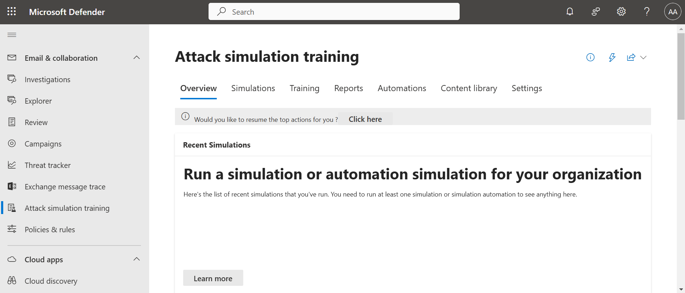
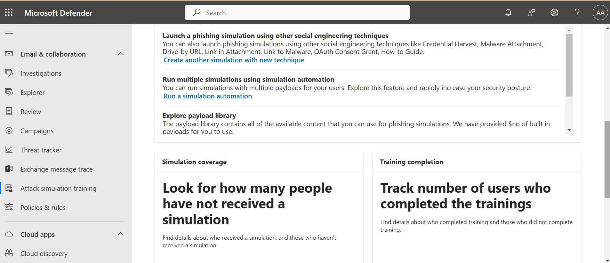
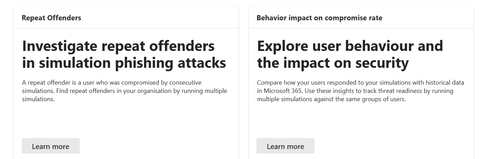

### Select Technique:

Chose the “How-to Guide” technique.
This technique sends a phishing email containing a step-by-step guide instructing users on tasks like reporting phishing messages.
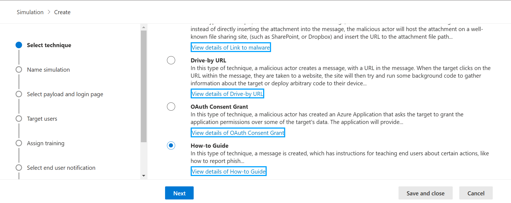

### Define Name and Description:

Named the simulation: “Phishing Awareness Campaign – How-to Guide.”
Added a description: “This simulation aims to assess and improve end-user understanding of phishing attempts through hands-on guidance on recognizing and reporting threats.”
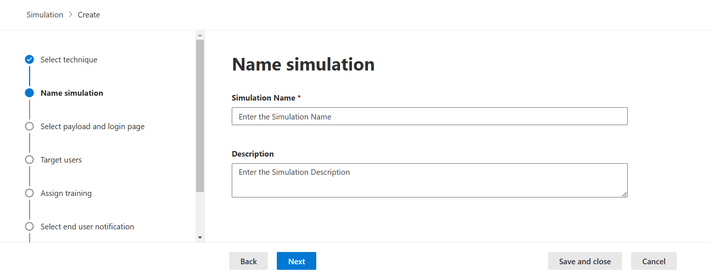

### Select Payload and Login Page:

Selected a realistic phishing payload, mimicking a common corporate notification.
Used a convincing login page template to emulate phishing scenarios while ensuring no real credentials were compromised.
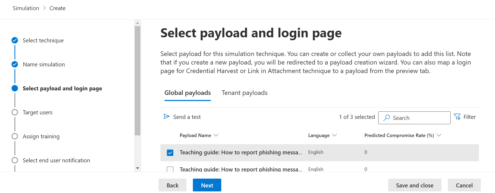

### Assign Users and Groups:

Targeted specific user groups across various departments, ensuring coverage of high-risk individuals based on prior security assessments.
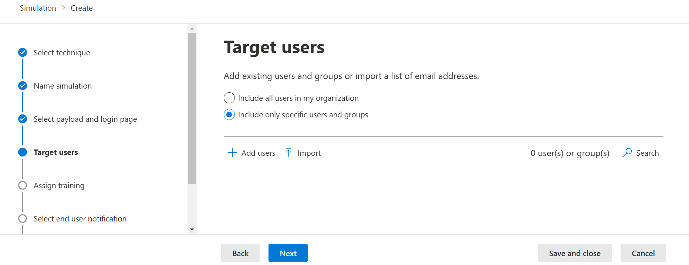
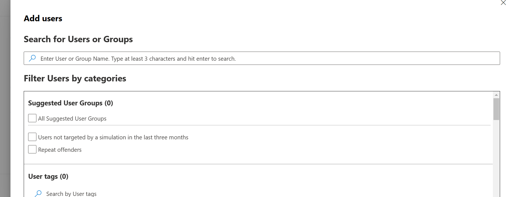
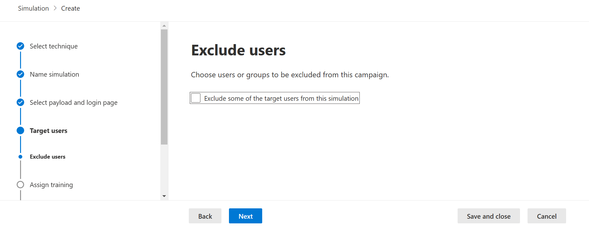

### Customize End-User Notifications:

Created tailored notification messages to be sent after the simulation.
These messages provided immediate feedback, highlighting potential red flags in the phishing email.
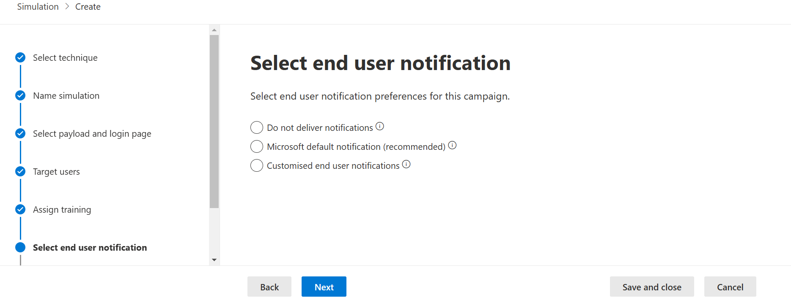

### Add Launch Details:

Scheduled the simulation with the following parameters:
Start Date: [Insert Date]
End Date: [Insert Date]
Ensured timelines aligned with organizational workflows to avoid disruptions.
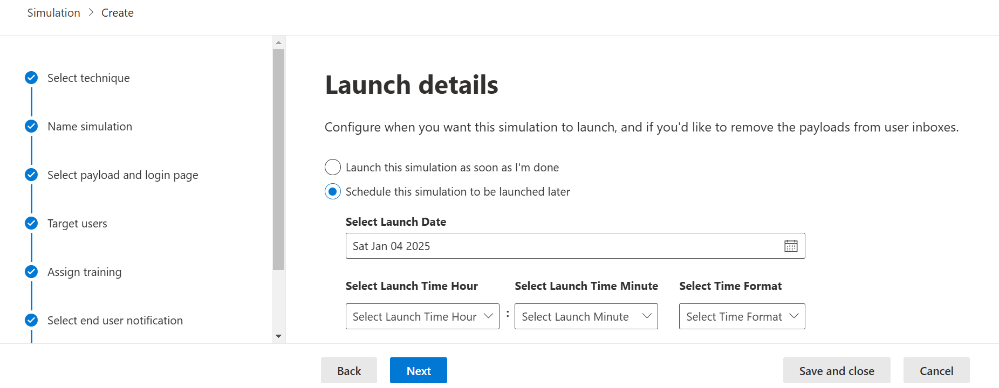

### Review and Submit Simulation:

Conducted a thorough review of all configurations, including payloads, notifications, and timelines.
Submitted the simulation for execution.
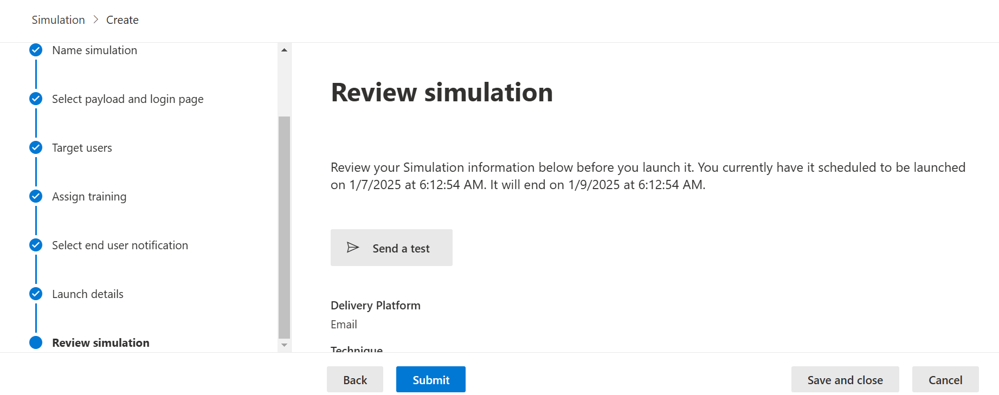

## Outcome:
The attack simulation provided valuable insights into the organization’s current security posture. 
Key metrics included the number of users who:
- Opened the phishing email.
- Clicked on the link.
- Reported the phishing attempt successfully.
Post-simulation feedback sessions were held to discuss findings, enhance user awareness, and implement further training.

## Key Skills Demonstrated:

- Proficiency in leveraging Microsoft Defender for attack simulation.
- Designing and executing phishing awareness campaigns.
- Assessing organizational resilience against phishing threats.
- Enhancing end-user security awareness through hands-on education.
